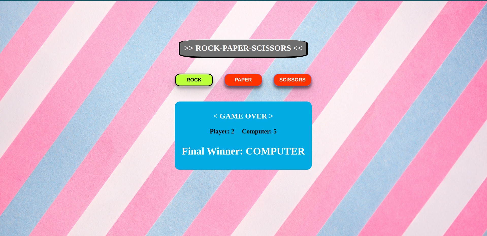

<h1>Rock-Paper-Scissors game</h1>

<h3>Description</h3>

Built a "Rock-Paper-Scissors" game using JavaScript that can be played against the Computer.

<h3><a href="https://vjharan.github.io/rock_paper_scissors_game/">view project</a></h3>

<h3>Project Screenshot</h3>

 

<h3>How to play the game:</h3>
<ul>
    <li>The game is played by a Player against the Computer</li>
    <li>Click any of the three buttons(Rock,Paper or Scissors) to start the game</li>
    <li>The running score is displayed</li>
    <li>Winner of each round is shown</li>
    <li>Final winner is announced once one player reaches 5 points. </li>
</ul>

<h3>Technologies used</h3>
<ul>
    <li>HTML5</li>
    <li>CSS</li>
    <li>JavaScript</li>
</ul>
